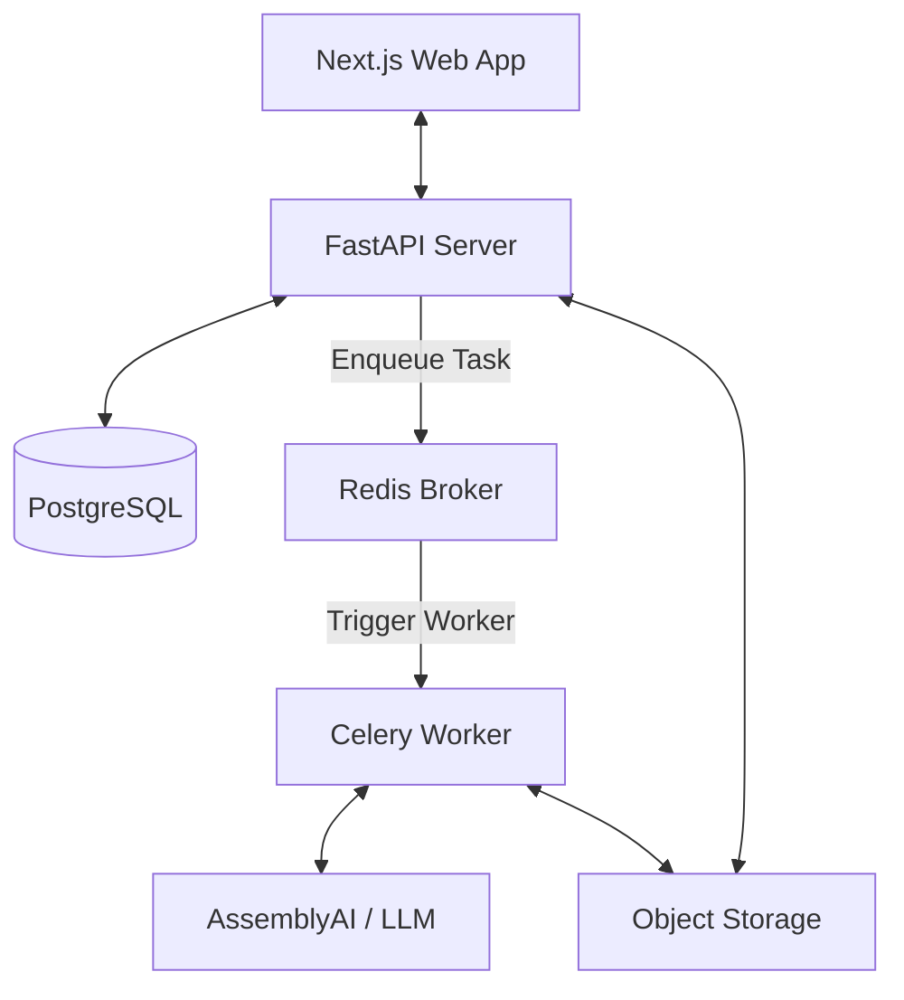

# System Architecture - Eden Intelligence

Eden is an enterprise-grade AI meeting intelligence platform designed for high-precision transcription and summarization.

## Technical Stack

### Frontend
- **Framework**: Next.js 14 (App Router)
- **Language**: TypeScript
- **Styling**: Tailwind CSS
- **State Management**: React Context (AuthContext)
- **API Client**: Axios with JWT Interceptors

### Backend
- **Framework**: FastAPI (Python)
- **Execution**: Celery (Asynchronous Task Queue)
- **Broker/Cache**: Redis
- **Database**: PostgreSQL (SQLAlchemy Async ORM)
- **Object Storage**: AWS S3 (or compatible)

### AI Services
- **Transcription**: AssemblyAI (Real-time & Batch with Speaker Diarization)
- **Intelligence**: LLM-based Summarization & Extraction (Plan integration)

---

## High-Level Architecture

The system follows a modern decoupled architecture with a focus on asynchronous processing for heavy AI workloads.

---

## Core Workflows

### 1. Authentication & Security
- **JWT Recovery**: Stateless authentication using Access and Refresh tokens.
- **Email Verification**: Mandatory verification flow via SMTP before account activation.
- **Protected Routes**: Frontend gating via `ProtectedRoute` component and backend dependency injection for token validation.

### 2. Meeting Processing Pipeline
1.  **Ingestion**: User uploads a recording or provides a link.
2.  **Storage**: The audio file is securely stored in S3.
3.  **Async Decoupling**: API enqueues a `process_recording` task to Celery and returns a 202 Accepted.
4.  **Transcription**: Celery worker invokes **AssemblyAI** to transcribe and attribute speech to specific speakers.
5.  **Intelligence**: The transcript is passed to the LLM layer for summarization, action item extraction, and decision mapping.
6.  **Persistence**: Final results are saved to PostgreSQL and the user is notified.

### 3. Data Integrity & Resilience
- **Idempotency**: The AI pipeline is designed to be idempotent, allowing tasks to be retried safely.
- **Encryption**: Support for symmetric encryption of sensitive fields at rest using Fernet.
